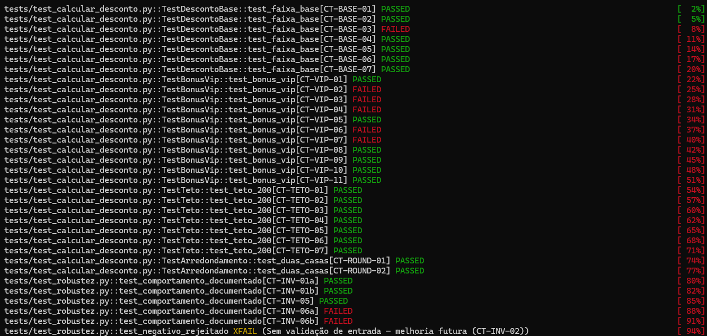
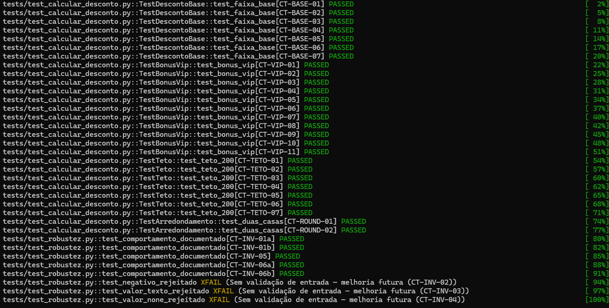

# QA — Marco VA01

Repositório de atividades de Qualidade de Software.

---

## Tasks

### 1. Código corrigido (1 point)

> **Informe o código principal corrigido.**

- [x] Corrigir o código principal (`src/codigo.py`)
- [x] Incluir o código corrigido neste espaço

**Bugs corrigidos:**

1. **Limite de R$ 100,00**: a condição original usava `valor_compra > 100`, excluindo compras de exatamente R$ 100,00 do desconto de 10% (regra pede `>= 100`). Substituído por cadeia `if/elif/else` progressiva.
2. **VIP case-insensitive**: a regra exige reconhecer "VIP" em qualquer caixa (`vip`, `Vip`, etc.), mas o código original comparava apenas `== "VIP"`. Corrigido com `.strip().upper()`.

Arquivo: [`src/codigo_corrigido.py`](src/codigo_corrigido.py)

```python
def calcular_desconto(valor_compra, tipo_cliente):
    desconto = 0

    # Desconto base progressivo
    if valor_compra < 100:
        desconto = 0
    elif valor_compra < 500:
        desconto = 0.10
    else:
        desconto = 0.20

    # Bônus VIP (case-insensitive)
    if str(tipo_cliente).strip().upper() == "VIP":
        desconto += 0.05

    valor_desconto = valor_compra * desconto

    # Regra do Teto de R$ 200,00
    if valor_desconto > 200:
        valor_desconto = 200

    return round(valor_desconto, 2)
```

---

### 2. Cenários de teste (1 point)

> **Informe todos os cenários (textual).**
> Fique atento para dados inesperados que não estavam descritos explicitamente na regra.

- [x] Listar os cenários de teste (textual)

Ver [`cenarios.md`](cenarios.md): 33 cenários em 5 grupos —
desconto base/fronteiras (CT-BASE), bônus VIP e variações de escrita (CT-VIP),
teto de R$ 200 (CT-TETO), arredondamento (CT-ROUND) e
dados inesperados/robustez (CT-INV).

```
# Cenários detalhados em cenarios.md
```

---

### 3. Bugs encontrados e escolha dos dados (1 point)

> **Descreva detalhadamente:**
> Quais foram os bugs (erros de lógica) que você encontrou no código original?
> E como a escolha dos valores dos seus testes ajudou a revelar esses erros?

- [x] Descrever os bugs encontrados
- [x] Explicar como a escolha dos valores de teste revelou os bugs

**Bug 1 — Fronteira de R$ 100,00 excluída dos 10% (lógica + análise de valor limite)**
O código original usava `valor_compra > 100`, mas a regra diz "igual ou maior que
R$ 100,00". Compras de exatamente R$ 100,00 recebiam 0% em vez de 10%.
Revelado por: CT-BASE-03 `(100, "COMUM")` → esperado 10.0, obtido 0;
confirmado por CT-INV-06a/06b (`100` int e `100.0` float falham igual — o bug é
na comparação, não no tipo). Por isso o "teste de cabeça" do Jr. passou: R$ 300
cai no meio da faixa (CT-BASE-04 verde no original), longe da fronteira.

**Bug 2 — Bônus VIP só em caixa alta (particionamento por variação de escrita)**
O código comparava `tipo_cliente == "VIP"`, mas a regra exige reconhecer "VIP"
"independente de estar escrito em maiúsculo ou minúsculo".
Revelado por: CT-VIP-02 `(99.99, "vip")`, CT-VIP-03 `(100, "Vip")`,
CT-VIP-04 `(300, "vip")`, CT-VIP-06 `(300, "vIp")`, CT-VIP-07 `(300, " vip ")`
— todos sem o +5% no código original. CT-VIP-05 `(500, "VIP")` passava, o que
isolou a causa na comparação de strings, não no cálculo do bônus.

**Não-bugs (confirmados pela suite):** teto de R$ 200 (todos os CT-TETO verdes
no original), VIP em caixa alta, COMUM sem acréscimo e `None`/desconhecido
tratados sem quebrar.

**Robustez (fora da regra, documentado como `xfail`):** valor negativo
(`-100` + VIP retorna `-5.0`), valor como texto/`None` (lançam `TypeError` sem
mensagem clara). Proposta de melhoria futura: validar entradas com `ValueError`
— ver CT-INV-02/03/04 em [`cenarios.md`](cenarios.md).

---

### 4. PRINT1 — Relatório de testes ANTES da correção (1 point)

> **Upload de 1 arquivo: imagem. Máx. 10 MB.**

- [x] Adicionar print do relatório de testes **antes** de corrigir o código

Comando executado (alvo = lógica original do Jr.):

```powershell
$env:ALVO="codigo_original"; python -m pytest -v
```



**Resultado do PRINT1: 8 falhas, 24 passaram, 3 xfail** (35 testes).
Falhas — exatamente os cenários dos 2 bugs: CT-BASE-03, CT-VIP-02, CT-VIP-03,
CT-VIP-04, CT-VIP-06, CT-VIP-07, CT-INV-06a e CT-INV-06b
(estes dois últimos cobrem a mesma fronteira de R$ 100,00 com `int`/`float`).

---

### 5. PRINT2 — Relatório de testes DEPOIS da correção (1 point)

> **Upload de 1 arquivo: imagem. Máx. 10 MB.**

- [x] Adicionar print do relatório de testes **depois** de corrigir o código

Comando executado (alvo padrão = código corrigido):

```powershell
Remove-Item Env:ALVO -ErrorAction SilentlyContinue; python -m pytest -v
```



**Resultado do PRINT2: 32 passaram, 3 xfail, 0 falhas** (35 testes) — os 3
xfails são os CT-INV-02/03/04 (validação de entrada, melhoria futura
documentada).

---

## Como executar os testes

```powershell
# Código corrigido (PRINT2 — padrão)
python -m pytest -v

# Código original do Jr. (PRINT1 — espera-se 8 falhas)
$env:ALVO="codigo_original"; python -m pytest -v

# Voltar ao corrigido
Remove-Item Env:ALVO
```
